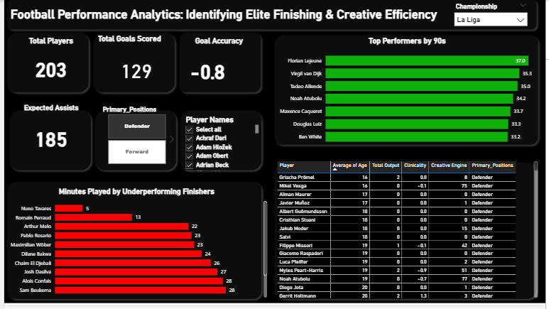
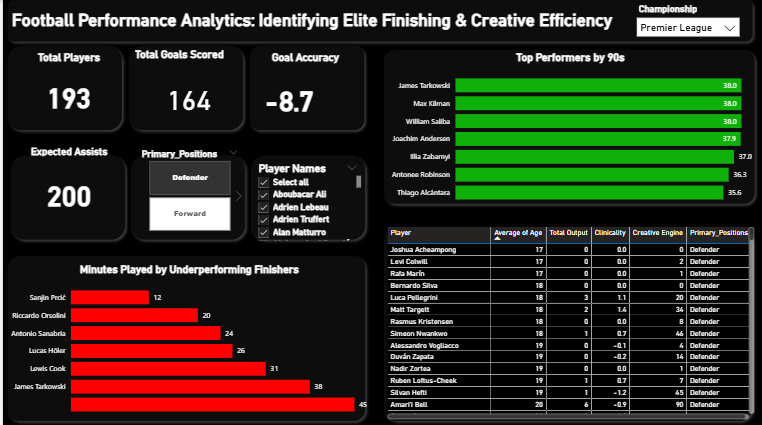

## 📊 Dashboard Gallery

| 1. Full League Overview | 2. Tactical Player Deep-Dive | 3. League Benchmark |
| :--- | :--- | :--- |
|  |  |  |

> **Note:** The dashboard is fully interactive. Selecting a specific player in the center table or search bar will dynamically update the **Clinicality**, **Expected Assists**, and **Minutes Played** metrics to reflect that individual's performance profile.
>
> 
# Football-Performance-Analytics
A Power BI scouting dashboard identifying elite finishing and playmaking efficiency across  football leagues using custom Clinicality ($Gls - xG$) and xAG metrics.
Project Overview

The Problem

Traditional scouting often relies on "Top Scorer" lists, which fail to account for luck or opportunity volume. A scout needs to know if a player is genuinely clinical or simply playing in a high-volume system. This project was designed to solve the "Efficiency Gap" by identifying players who overperform or underperform their statistical expectations.
The Data & Tools
Data Used: Multi-league football dataset (2025/26 season).

Tools: Microsoft Excel, Power BI Desktop, DAX, Power Query.

Insight: Identified "Underperforming Finishers" by comparing actual goals vs. Expected Goals (xG).

Result: A dynamic scouting tool that allows for instant player search and performance benchmarking.

Key Metrics: xG (Expected Goals), xAG (Expected Assists), 90s Played, and Finishing Accuracy.

The Journey: Challenges & Breakthroughs
The Technical Challenges
Data Noise & Normalization: The initial dataset included players with only 1 or 2 minutes of game time, creating "skewed" averages. I had to implement a Sum of 90s filter to ensure only players with significant involvement were analyzed.

UI/UX Logic: Designing a "Dark Mode" dashboard in Power BI required intense focus on conditional formatting. Synchronizing the background colors of KPI cards and ensuring the "Search Slicer" didn't break the layout was a repetitive but necessary process for professional polish.

The Analytical Breakthroughs
Custom KPI Engineering: I developed the "Clinicality Index" ($Gls - xG$) to visualize finishing variance. This turned raw numbers into a "Heat Map" of player performance.
Dual-Perspective Scouting: By integrating Expected Assists (xA) alongside goals, the dashboard successfully identifies "The Unsung Playmakers"—players who create chances that strikers might waste.
Search Optimization: Implementing a search-enabled slicer transformed the dashboard from a static report into an interactive Recruitment Search Engine.

Quantitative Methodology 
Metric Normalization: All performance data is viewed through a "Per 90" lens to remove bias against substitute players.

Efficiency Mapping: * Green Zone: Players with positive Clinicality (Elite Finishers).

Red Zone: Players with high minutes but negative Clinicality (Immediate Scouting Risks).

Variance Analysis: Calculated a -30.8 Goal Accuracy across the dataset, highlighting significant league-wide underperformance that suggests a "Scouter's Market" for clinical strikers.

The "Total Goals" Logic: Resolving cross-filtering issues where "Total Goals" showed the entire league instead of the filtered view required precise management of visual interactions.
